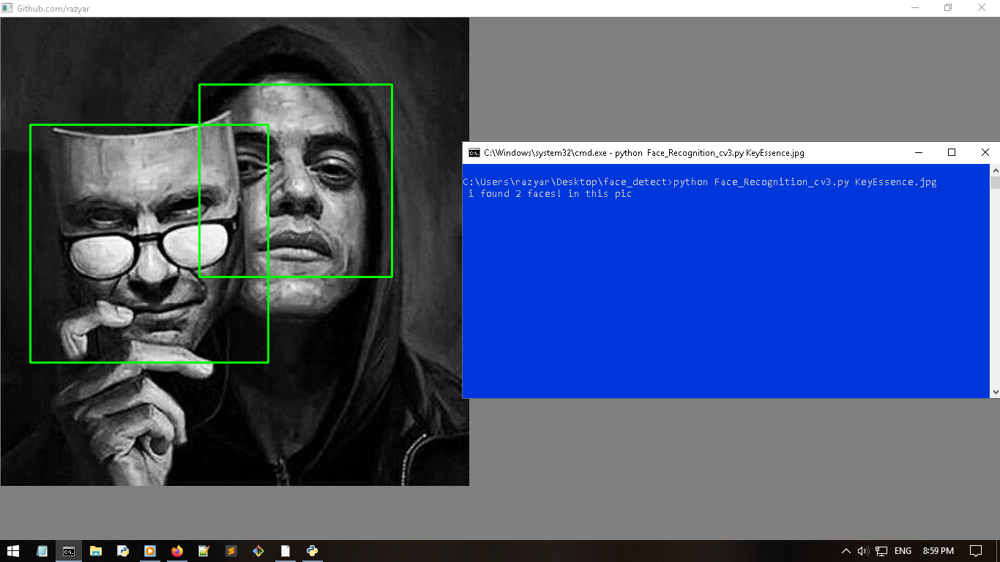

# FaceRecognition
Face recognition using python 

## Requirements: 
```bash
pip install opencv-python
```

## How to run?
simply copy your images to dir and run:

```bash
python FaceRecognition.py mypic.jpg #Any format
python FaceRecognition_cv3.py mypic.jpg #Any format
```

dont change haarcascade_frontalface_default.xml name or if you changed go and change name in FaceRecognition.py and FaceRecognition_cv3.py:

```python
imagePath = sys.argv[1]
cascPath = "haarcascade_frontalface_default.xml" #change this to new name
```

- my website: [razyar saeedian](https://khoderazyar.ir)


